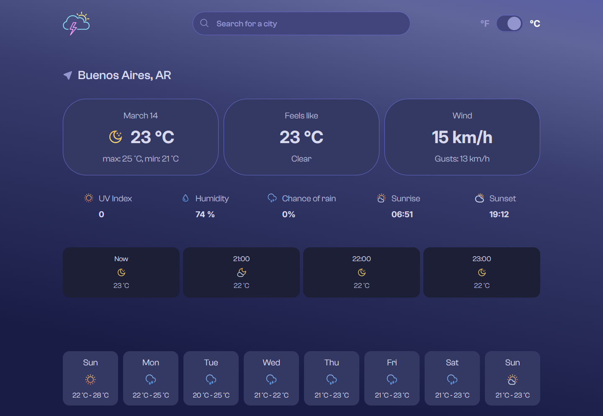

# ATMOS — JavaScript Weather Dashboard

A weather web app focused on clean UI and fast city-based forecasting. The application lets users search for locations, view current conditions, inspect hourly and weekly forecasts, and switch between Celsius and Fahrenheit units.

The project is built to demonstrate production-minded frontend fundamentals with modular JavaScript, async API integration, reusable rendering utilities, and responsive interface design.

**[Live Preview](https://dee-diaz.github.io/weather-app/)**



---

## Table of Contents

- [Features](#features)
- [Tech Stack](#tech-stack)
- [Architecture](#architecture)
- [Project Structure](#project-structure)
- [Local Setup](#local-setup)
- [Available Scripts](#available-scripts)
- [Testing](#testing)

---

## Features

### Weather Experience

- City search with autocomplete suggestions
- Current conditions overview (temperature, wind, humidity, UV, sunrise/sunset)
- Hourly forecast cards for the active day
- Weekly forecast cards for upcoming days

### User Flows

- Search by city and instantly refresh weather data
- Toggle temperature scale between Celsius and Fahrenheit
- Automatically rerender current, hourly, and weekly values when unit changes
- Handle missing weather fields with fallback formatting helpers

### API Integration

- Fetches city suggestions from the GeoNames Search API for autocomplete
- Fetches timeline weather data from Visual Crossing Weather API
- Encodes user-provided locations for safe request URLs
- Uses debounced input requests to reduce autocomplete API traffic
- Basic HTTP error handling for failed responses

---

## Tech Stack

### Frontend

- **JavaScript (ES Modules)**
- **HTML5**
- **CSS3**
- **Webpack 5**
- **date-fns + date-fns-tz**
- **ESLint + Prettier**

### External Service

- **Visual Crossing Weather API**
- **GeoNames Search API**

---

## Architecture

### App Initialization

`src/index.js` coordinates startup behavior:

- Initializes temperature toggle behavior
- Initializes autocomplete interactions
- Loads a default location on page load
- Orchestrates full rerendering when data or units change

### Rendering Layer

Rendering concerns are separated into focused functions:

- `renderWeatherDetailsData(...)` for primary weather stats
- `renderHourlyForecastData(...)` for hourly cards
- `renderWeeklyForecastData(...)` for week view
- `rerenderWeatherDetails(...)` for unit-switch updates

This separation keeps data handling and DOM updates easier to reason about.

### Utilities & Formatting

Utility helpers are reused for:

- Temperature conversion (Celsius ↔ Fahrenheit)
- Time and date formatting
- Defensive value formatting with defaults

---

## Project Structure

```bash
weather-app/
├── src/
│   ├── assets/
│   │   ├── fonts/
│   │   └── img/
│   ├── components/
│   │   ├── autocomplete.js
│   │   ├── dataFetching.js
│   │   ├── renderFetchedData.js
│   │   ├── toggleButton.js
│   │   └── utils.js
│   ├── index.html
│   ├── index.js
│   └── style.css
├── webpack.common.js
├── webpack.dev.js
├── webpack.prod.js
└── package.json
```

---

## Local Setup

### Prerequisites

- Node.js 18+ (Node 20+ recommended)
- npm

### 1) Clone and install

```bash
git clone <your-repo-url>
cd weather-app
npm install
```

### 2) Run development server

```bash
npm run dev
```

### 3) Build for production

```bash
npm run build
```

---

## Available Scripts

```bash
npm run dev      # start webpack dev server
npm run build    # production build
npm run lint     # run ESLint
npm run format   # run Prettier formatting
npm run deploy   # push dist/ subtree to gh-pages
```

---

## Testing

The project currently focuses on linting-based quality checks.

Run checks:

```bash
npm run lint
```
